# ICT-FaceKit
ICT's Vision and Graphics Lab's morphable face model and toolkit

## ICT Face Model Light
The light version of the ICT Face Model consists of a base topology along with definitions of facial landmarks, rigid, and morphable vertices, and a set of linear shape vectors in the form of principal components of light stage scan data registered to a common topology.

ICT-FaceKit is released under the MIT license.

### Face Model Topology

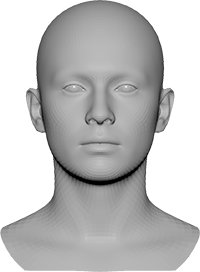
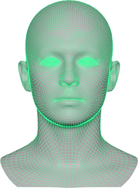
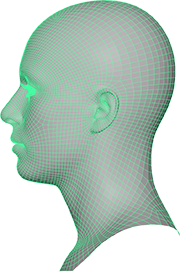
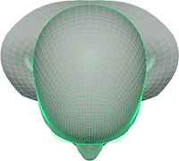

| Ordinal#| Geometry name        | Vertex indices | Polygon indices | #Vertices | #Faces |
|---------|----------------------|----------------|-----------------|-----------|--------|
| n/a     | All                  | [0:26718]      | [0:26383]       | 26719     | 26384  |
| #0      | Face                 | [0:9408]       | [0:9229]        | 9409      | 9230   |
| #1      | Head and Neck        | [9409:11247]   | [9230:11143]    | 1839      | 1914   |
| #2      | Mouth socket         | [11248:13293]  | [11144:13225]   | 2046      | 2082   |
| #3      | Eye socket left      | [13294:13677]  | [13226:13629]   | 384       | 404    |
| #4      | Eye socket right     | [13678:14061]  | [13630:14033]   | 384       | 404    |
| #5      | Gums and tongue      | [14062:17038]  | [14034:17005]   | 2977      | 2972   |
| #6      | Teeth                | [17039:21450]  | [17006:21495]   | 4412      | 4490   |
| #7      | Eyeball left         | [21451:23020]  | [21496:23093]   | 1570      | 1598   |
| #8      | Eyeball right        | [23021:24590]  | [23094:24691]   | 1570      | 1598   |
| #9      | Lacrimal fluid left  | [24591:24794]  | [24692:24854]   | 204       | 163    |
| #10     | Lacrimal fluid right | [24795:24998]  | [24855:25017]   | 204       | 163    |
| #11     | Eye blend left       | [24999:25022]  | [25018:25032]   | 24        | 15     |
| #12     | Eye blend right      | [25023:25046]  | [25033:25047]   | 24        | 15     |
| #13     | Eye occlusion left   | [25047:25198]  | [25048:25175]   | 152       | 128    |
| #14     | Eye occlusion right  | [25199:25350]  | [25176:25303]   | 152       | 128    |
| #15     | Eyelashes left       | [25351:26034]  | [25304:25843]   | 684       | 540    |
| #16     | Eyelashes right      | [26035:26718]  | [25844:26383]   | 684       | 540    |

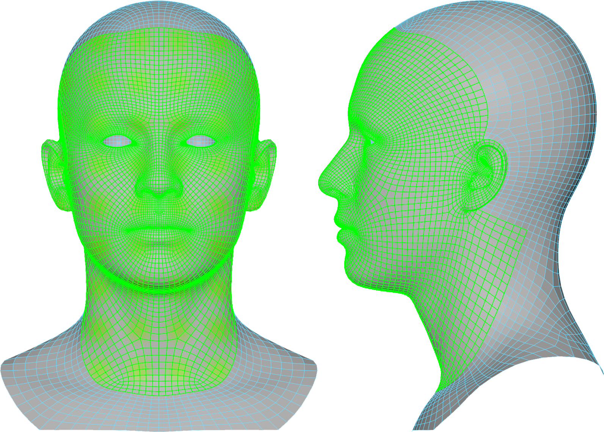
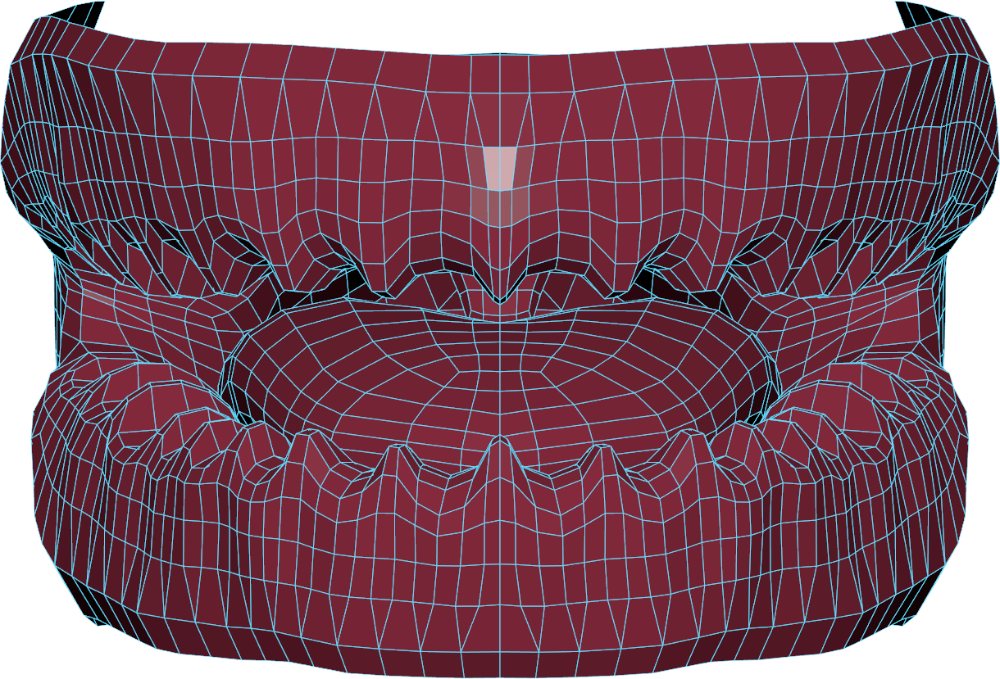
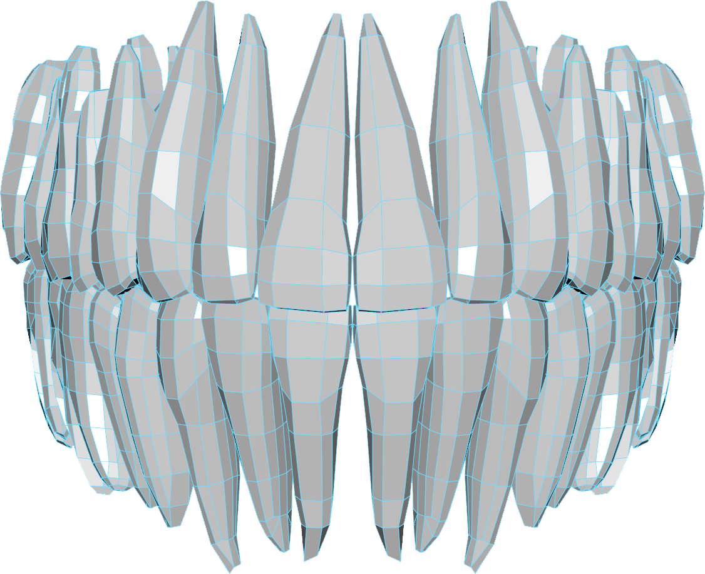
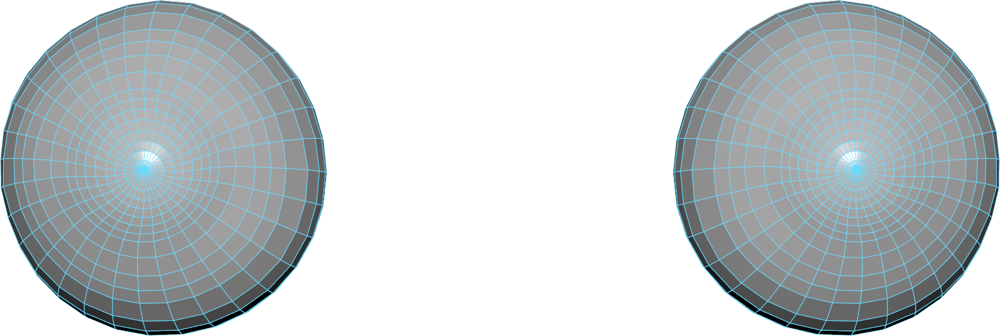
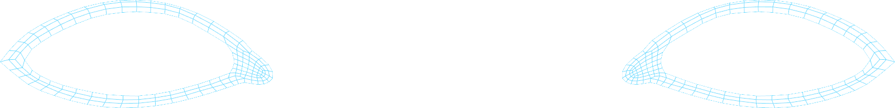
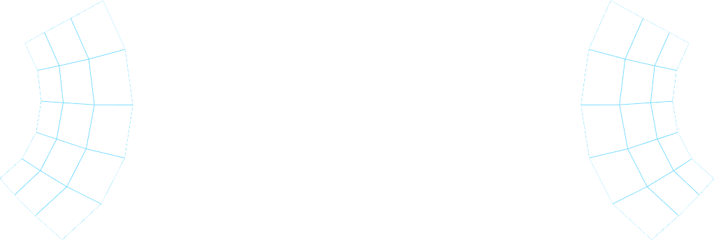
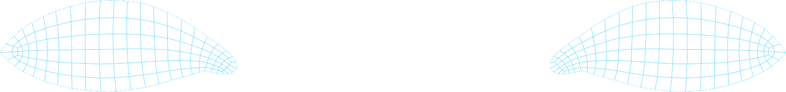
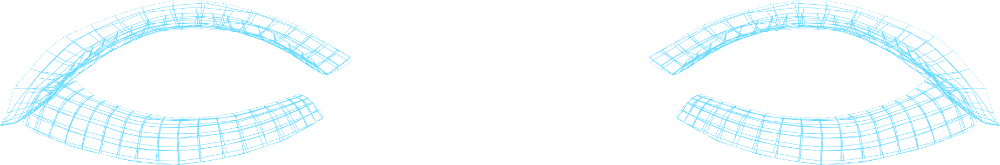

### UV Layout

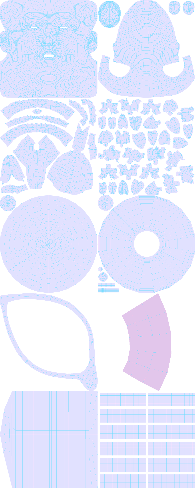

### Face Area Details

| Ordinal#| Geometry name    | Vertex indices | Polygon indices | #Vertices | #Faces |
|---------|------------------|----------------|-----------------|-----------|--------|
| #0      | Full face area   | [0:9408]       | [0:9229]        | 9409      | 9230   |
| #1      | Narrow face area | [0:6705]       | [0:6559]        | 6706      | 6560   |

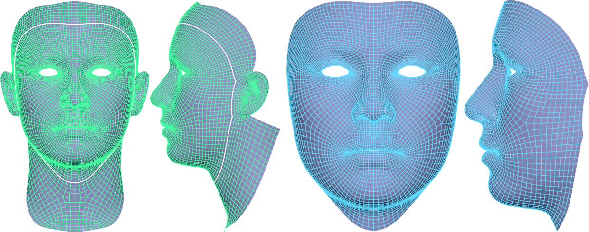

### Eyeball Details

| Ordinal#| Geometry name | Vertex indices | Polygon indices | #Vertices | #Faces |
|---------|---------------|----------------|-----------------|-----------|--------|
| #0      | Sclera left   | [21451:22220]  | [21496:22295]   | 770       | 800    |
| #1      | Iris left     | [22221:23020]  | [22296:23093]   | 800       | 798    |
| #2      | Sclera right  | [23021:23790]  | [23094:23893]   | 770       | 800    |
| #3      | Iris right    | [23791:24590]  | [23894:24691]   | 800       | 798    |

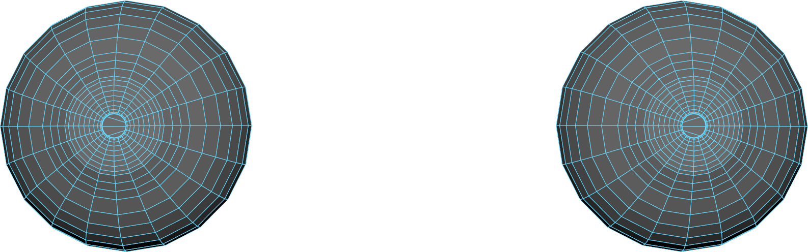

Additional eye geometry including lacrimal fluid, blend meshes, and occlusion meshes adopts the style of Unreal Engine's [Digital Human Project](https://docs.unrealengine.com/en-US/Resources/Showcases/DigitalHumans/index.html "Unreal Engine's Digital Human Project"). The existing geometries are plug and play with Unreal Engine's shaders.

### Teeth Details

| Ordinal# | Tooth name                  | Vertex indices | Polygon indices | #Vertices | #Faces |
|----------|-----------------------------|----------------|-----------------|-----------|--------|
| #0       | 3rd Molar upper left        | [17039:17229]  | [17006:17203]   | 191       | 198    |
| #1       | 2nd Molar upper left        | [17230:17415]  | [17204:17397]   | 186       | 194    |
| #2       | 1st Molar upper left        | [17416:17606]  | [17398:17592]   | 191       | 195    |
| #3       | 2nd Bicuspid upper left     | [17607:17729]  | [17593:17717]   | 123       | 125    |
| #4       | 1st Bicuspid upper left     | [17730:17894]  | [17718:17885]   | 165       | 168    |
| #5       | Canine upper left           | [17895:17990]  | [17886:17979]   | 96        | 94     |
| #6       | Lateral incisor upper left  | [17991:18066]  | [17980:18053]   | 76        | 74     |
| #7       | Central incisor upper left  | [18067:18142]  | [18054:18127]   | 76        | 74     |
| #8       | Central incisor upper right | [18143:18218]  | [18128:18201]   | 76        | 74     |
| #9       | Lateral incisor upper right | [18219:18294]  | [18202:18275]   | 76        | 74     |
| #10      | Canine upper right          | [18295:18390]  | [18276:18369]   | 96        | 94     |
| #11      | 1st Bicuspid upper right    | [18391:18555]  | [18370:18537]   | 165       | 168    |
| #12      | 2nd Bicuspid upper right    | [18556:18678]  | [18538:18662]   | 123       | 125    |
| #13      | 1st Molar upper right       | [18679:18869]  | [18663:18857]   | 191       | 195    |
| #14      | 2nd Molar upper right       | [18870:19055]  | [18858:19051]   | 186       | 194    |
| #15      | 3rd Molar upper right       | [19056:19246]  | [19052:19249]   | 191       | 198    |
| #16      | 3rd Molar lower left        | [19247:19425]  | [19250:19433]   | 179       | 184    |
| #17      | 2nd Molar lower left        | [19426:19601]  | [19434:19615]   | 176       | 182    |
| #18      | 1st Molar lower left        | [19602:19813]  | [19616:19831]   | 212       | 216    |
| #19      | 2nd Bicuspid lower left     | [19814:19951]  | [19832:19972]   | 138       | 141    |
| #20      | 1st Bicuspid lower left     | [19952:20078]  | [19973:20103]   | 127       | 131    |
| #21      | Canine lower left           | [20079:20168]  | [20104:20193]   | 90        | 90     |
| #22      | Lateral incisor lower left  | [20169:20262]  | [20194:20288]   | 94        | 95     |
| #23      | Central incisor lower left  | [20263:20348]  | [20289:20372]   | 86        | 84     |
| #24      | Central incisor lower right | [20349:20434]  | [20373:20456]   | 86        | 84     |
| #25      | Lateral incisor lower right | [20435:20528]  | [20457:20551]   | 94        | 95     |
| #26      | Canine lower right          | [20529:20618]  | [20552:20641]   | 90        | 90     |
| #27      | 1st Bicuspid lower right    | [20619:20745]  | [20642:20772]   | 127       | 131    |
| #28      | 2nd Bicuspid lower right    | [20746:20883]  | [20773:20913]   | 138       | 141    |
| #29      | 1st Molar lower right       | [20884:21095]  | [20914:21129]   | 212       | 216    |
| #30      | 2nd Molar lower right       | [21096:21271]  | [21130:21311]   | 176       | 182    |
| #31      | 3rd molar lower right       | [21272:21450]  | [21312:21495]   | 179       | 184    |

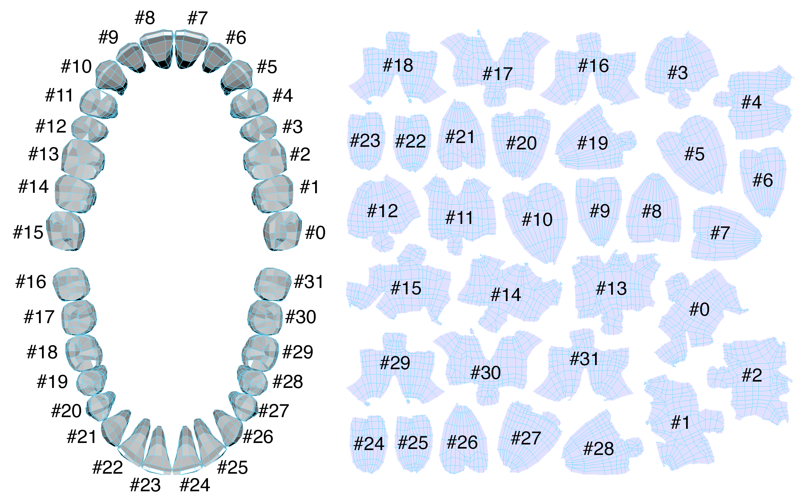

### Facial Landmarks

All the following indices are 0-indexed.

Multi-PIE 68 point facial landmarks indices:

    1225, 1888, 1052, 367, 1719, 1722, 2199, 1447, 966, 3661, 4390, 3927, 3924, 2608, 3272, 4088, 3443, 268, 493, 1914, 2044, 1401, 3615, 4240, 4114, 2734, 2509, 978, 4527, 4942, 4857, 1140, 2075, 1147, 4269, 3360, 1507, 1542, 1537, 1528, 1518, 1511, 3742, 3751, 3756, 3721, 3725, 3732, 5708, 5695, 2081, 0, 4275, 6200, 6213, 6346, 6461, 5518, 5957, 5841, 5702, 5711, 5533, 6216, 6207, 6470, 5517, 5966

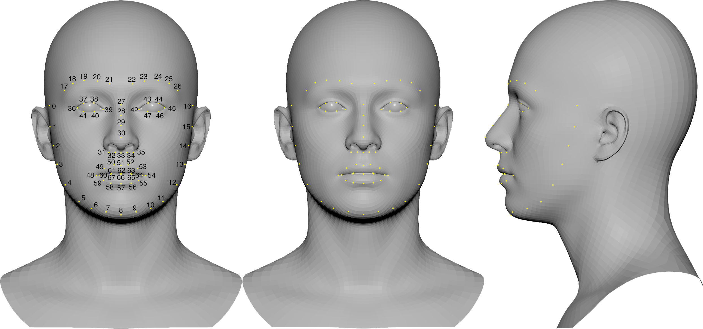

Right jawline (substitutes 0-7 in Multi PIE):

    1278, 1272, 12, 1834, 243, 781, 2199, 1447

Left jawline (substitutes 9-16 in Multi PIE):

    3661, 4390, 3022, 2484, 4036, 2253, 3490, 3496

Right extended jawline (superset of right jawline):

    1280, 1278, 1275, 1272, 1248, 12, 820, 1834, 1902, 243, 844, 781, 1673, 2199, 801, 1447, 800

Left extended jawline (superset of left jawline):

    3041, 3661, 3042, 4390, 3880, 3022, 3085, 2484, 4102, 4036, 3061, 2253, 3466, 3490, 3493, 3496, 3498

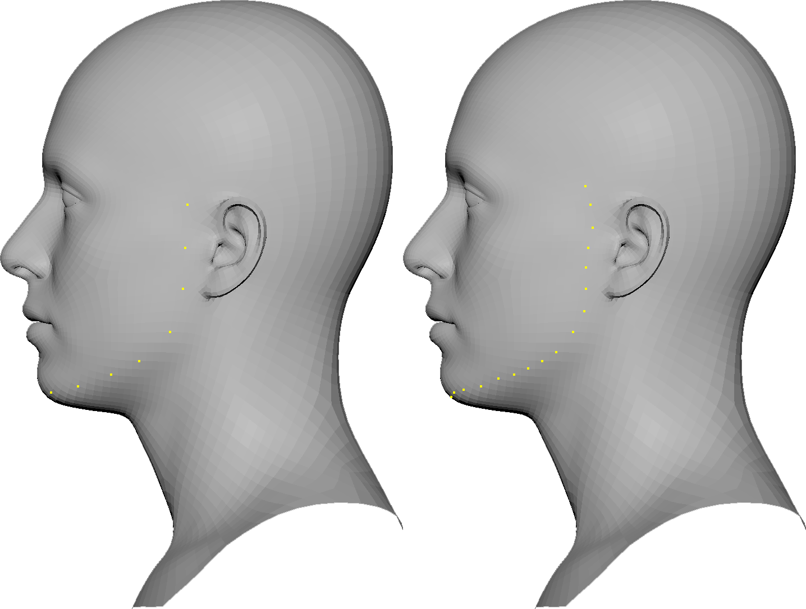

### Identity shape vectors

ICT Face Model Light includes a set of 100 PCA modes of linear morph targets. The linear morphing affects the full geometry of the face model and is based on light stage facial scan data.

"What is a Linear 3D Morphable Face Model?" (Youtube link):

### Expression Shapes

Current expression shapes adopt the naming convention of the Apple ARKit, but with "Left" and "Right" specified with "\_L" and "\_R". Additionally, we separeate the shapes (`browInnerUp_L` and `browInnerUp_R`), and (`cheekPuff_L` and `cheekPuff_R`).

Our expression shapes closest relation to FACS units are as follows:

| FACS unit                 | Our shapes                          |
|---------------------------|-------------------------------------|
| AU1 Inner brow raiser     | browInnerUp_L + browInnerUp_R       |
| AU2 Outer brow raiser     | browOuterUp_L + browOuterUp_R       |
| AU4 Brow lowerer          | browDown_L + browDown_R             |
| AU6 Cheek raiser          | cheekSquint_L + cheekSquint_R       |
| AU5 Upper lid raiser      | eyeWide_L + eyeWide_R               |
| AU7 Lid tightener         | eyeSquint_L + eyeSquint_R           |
| AU9 Nose Wrinkler         | noseSneer_L + noseSneer_R           |
| AU10 Upper lip raiser     | mouthShrugUpper                     |
| AU11 Nasolabial deepener  | mouthUpperUp_L + mouthUpperUp_R     |
| AU12 Lip corner puller    | mouthSmile_L + mouthSmile_R         |
| AU14 Dimpler              | mouthDimple_L + mouthDimple_R       |
| AU15 Lip corner depressor | mouthFrown_L + mouthFrown_R         |
| AU16 Lower lip depressor  | mouthLowerDown_L + mouthLowerDown_R |
| AU17 Chin raiser          | mouthShrugLower                     |
| AU18 Lip Pucker           | mouthPucker                         |
| AU20 Lip stretcher        | mouthStretch_L + mouthStretch_R     |
| AU22 Lip Funneler         | mouthFunnel                         |
| AU24 Lip pressor          | mouthPress_L + mouthPress_R         |
| AU27 Mouth stretch        | jawOpen                             |
| AU28 Lip Suck             | mouthRollLower + mouthRollUpper     |
| AU29 Jaw thrust           | jawForward                          |
| AU30 Jaw sideways (left)  | jawLeft                             |
| AU30 Jaw sideways (right) | jawRight                            |
| AU33 Cheek blow           | cheekPuff_L + cheekPuff_R           |
| AU45 Blink                | eyeBlink_L + eyeBlink_R             |
| AU61 Eyes turn left       | eyeLookOut_L + eyeLookIn_R          |
| AU62 Eyes turn right      | eyeLookOut_R + eyeLookIn_L          |
| AU63 Eyes up              | eyeLookUp_L + eyeLookUp_R           |
| AU64 Eyes down            | eyeLookDown_L + eyeLookDown_R       |

## Full ICT Face Model

Additional features are supported in ICT's Full face model. Some features of the full model are still under development. The full model will be released under a different USC specific license. For questions, or to sign up for a note on when it will be ready, contact kallebladin@gmail.com, or haase@ict.usc.edu

| Feature                              | ICT Face Model Light | Full ICT Face Model |
|--------------------------------------|----------------------|---------------------|
| Base model topology                  | Yes                  | Yes                 |
| #PCA Identity shape modes            | 100                  | 200+                |
| #PCA Identity albedo modes           | 0                    | 200+                |
| #Expression blend shapes             | 53                   | 53                  |
| FBX face rig                         | No                   | Yes                 |
| Albedo to specularity inference      | No                   | Yes                 |
| Albedo to displacement inference     | No                   | Yes                 |

## Script Package

This software package comes with some example scripts to get started. First, install external python packages:

    pip install numpy
    pip install openmesh

cd in to the `/Scripts` directory as some example scripts require this root path.

Run example scripts:

    python sample_random.py
    python read_identity.py

Outputs will be written in `/sample_data_out`

## Publications

### Learning Formation of Physically Based Face Attributes
CVPR 2020 : IEEE/CVF Conference on Computer Vision and Pattern Recognition

#### Abstract
Based on a combined data set of 4000 high resolution facial scans, we introduce a non-linear morphable face model, capable of producing multifarious face geometry of pore-level resolution, coupled with material attributes for use in physically-based rendering.
We aim to maximize the variety of the participants' face identities, while increasing the robustness of correspondence between unique components, including middle-frequency geometry, albedo maps, specular intensity maps and high-frequency displacement details. Our deep learning based generative model learns to correlate albedo and geometry, which ensures the anatomical correctness of the generated assets. We demonstrate potential use of our generative model for novel identity generation, model fitting, interpolation, animation, high fidelity data visualization, and low-to-high resolution data domain transferring. We hope the release of this generative model will encourage further cooperation between all graphics, vision, and data focused professionals, while demonstrating the cumulative value of every individuals' complete biometric profile.

#### Citing
BibTex:

    @misc{li2020learning,
    title={Learning Formation of Physically-Based Face Attributes},
    author={Ruilong Li and Karl Bladin and Yajie Zhao and Chinmay Chinara and Owen Ingraham and Pengda Xiang and Xinglei Ren and Pratusha Prasad and Bipin Kishore and Jun Xing and Hao Li},
    year={2020},
    eprint={2004.03458},
    archivePrefix={arXiv},
    primaryClass={cs.CV}
    }
